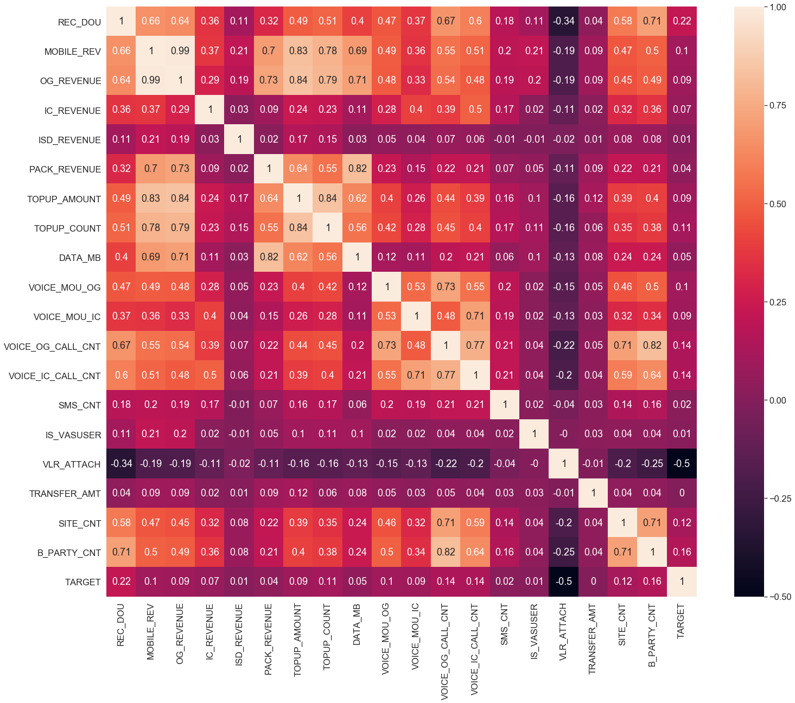
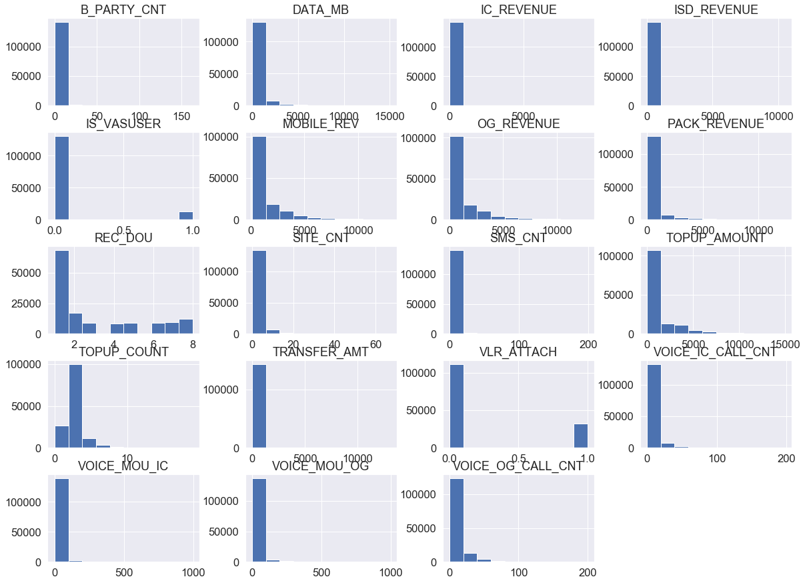
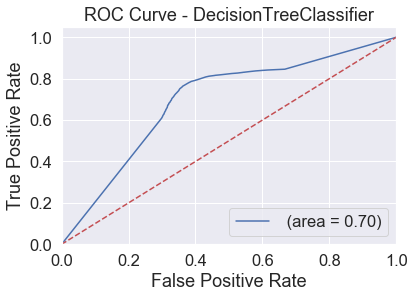
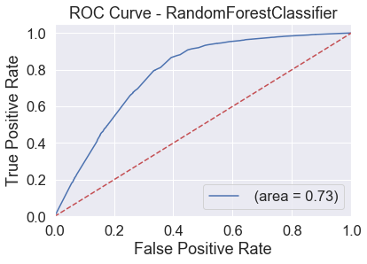
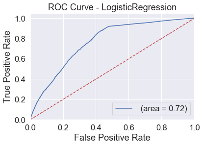
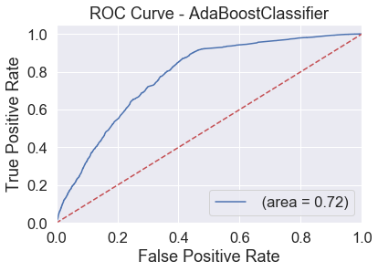
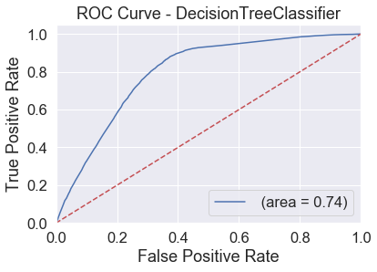
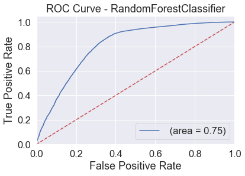
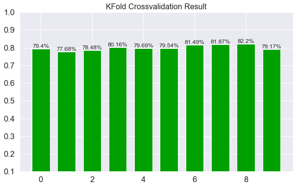
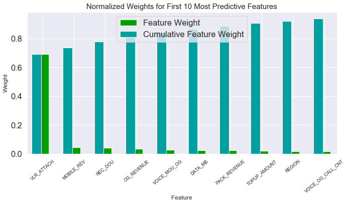

## Project Overview

In our country, Telecom industry is getting growth and highly competitive market since last few years. So, all operators are struggling to maintain existing customers and to obtain new acquisition. Our company also trying to maintain the existing customers in various ways: by offering the attractive packs, making loyalty programs, propose high end customers to use postpaid plan, etc. To get the gross add customers, we are offering attractive newbies benefits such as free data usage, free voice.

In here, some customers have used free benefit and churned out. So, we need know the behavior of GA customers who will be mature customers and still attach in our network. In this project, I will emphasize the quality GA who are still active and using our services in 3rd month after activation date. So that, our business team can do planning the appropriate program/campaigns to get the quality GA customers.

## Problem Statement

Since the size of these data sources is impossible for a human analyst to come up with interesting information that will help in the decision-making process. Machine learning models are completely helping in this identifying those quality GA customers. With the experimental results I will demonstrate the performance of the models by statistical metrics like accuracy, sensitivity, precision, recall, etc. Regarding the higher scoring of these metrics, we will be able to judge the success of these models in predicting the quality GA customers.

## Dataset

Monthly average gross addition count is ~ 0.8 Mn. And I will use the Jan-9 Gross add customers and predict who will be the quality GA in Mar-19.
Since this data is our company data, I have already taken the prior approval from our company’s management. And I got the right to use since the customer’s details information is not included.

### Importing Libraries and Loading Dataset


```python
import numpy as np
import pandas as pd
import matplotlib.pyplot as plt
import seaborn as sns

from time import time
from IPython.display import display 
%matplotlib inline
```


```python
# Load the dataset
data = pd.read_csv("Data.csv")
display(data.head(5))
display (data.shape)
```


<div>
<style scoped>
    .dataframe tbody tr th:only-of-type {
        vertical-align: middle;
    }

    .dataframe tbody tr th {
        vertical-align: top;
    }

    .dataframe thead th {
        text-align: right;
    }
</style>
<table border="1" class="dataframe">
  <thead>
    <tr style="text-align: right;">
      <th></th>
      <th>REGION</th>
      <th>REC_DOU</th>
      <th>MOBILE_REV</th>
      <th>OG_REVENUE</th>
      <th>IC_REVENUE</th>
      <th>ISD_REVENUE</th>
      <th>PACK_REVENUE</th>
      <th>TOPUP_AMOUNT</th>
      <th>TOPUP_COUNT</th>
      <th>DATA_MB</th>
      <th>...</th>
      <th>VOICE_OG_CALL_CNT</th>
      <th>VOICE_IC_CALL_CNT</th>
      <th>SMS_CNT</th>
      <th>IS_VASUSER</th>
      <th>HS_TYPE</th>
      <th>VLR_ATTACH</th>
      <th>TRANSFER_AMT</th>
      <th>SITE_CNT</th>
      <th>B_PARTY_CNT</th>
      <th>TARGET</th>
    </tr>
  </thead>
  <tbody>
    <tr>
      <th>0</th>
      <td>Yangon</td>
      <td>6</td>
      <td>816.6623</td>
      <td>563.53</td>
      <td>16.3333</td>
      <td>66.67</td>
      <td>0.0</td>
      <td>3000.0</td>
      <td>2</td>
      <td>99.296449</td>
      <td>...</td>
      <td>18</td>
      <td>11</td>
      <td>2</td>
      <td>0</td>
      <td>3G</td>
      <td>0</td>
      <td>0.0</td>
      <td>2</td>
      <td>3</td>
      <td>1</td>
    </tr>
    <tr>
      <th>1</th>
      <td>Yangon</td>
      <td>2</td>
      <td>2992.1600</td>
      <td>2857.16</td>
      <td>0.0000</td>
      <td>0.00</td>
      <td>2380.0</td>
      <td>3000.0</td>
      <td>2</td>
      <td>2795.949213</td>
      <td>...</td>
      <td>1</td>
      <td>0</td>
      <td>0</td>
      <td>0</td>
      <td>4G</td>
      <td>0</td>
      <td>0.0</td>
      <td>0</td>
      <td>0</td>
      <td>0</td>
    </tr>
    <tr>
      <th>2</th>
      <td>Yangon</td>
      <td>1</td>
      <td>135.0000</td>
      <td>0.00</td>
      <td>0.0000</td>
      <td>0.00</td>
      <td>0.0</td>
      <td>1000.0</td>
      <td>2</td>
      <td>0.000000</td>
      <td>...</td>
      <td>1</td>
      <td>0</td>
      <td>0</td>
      <td>0</td>
      <td>UNKNOWN</td>
      <td>1</td>
      <td>0.0</td>
      <td>0</td>
      <td>0</td>
      <td>0</td>
    </tr>
    <tr>
      <th>3</th>
      <td>Yangon</td>
      <td>2</td>
      <td>272.4300</td>
      <td>0.00</td>
      <td>0.0000</td>
      <td>0.00</td>
      <td>0.0</td>
      <td>1000.0</td>
      <td>2</td>
      <td>0.000000</td>
      <td>...</td>
      <td>2</td>
      <td>0</td>
      <td>0</td>
      <td>0</td>
      <td>3G</td>
      <td>0</td>
      <td>0.0</td>
      <td>1</td>
      <td>1</td>
      <td>1</td>
    </tr>
    <tr>
      <th>4</th>
      <td>South</td>
      <td>1</td>
      <td>4901.8600</td>
      <td>4766.86</td>
      <td>0.0000</td>
      <td>0.00</td>
      <td>4760.0</td>
      <td>6000.0</td>
      <td>3</td>
      <td>1044.698189</td>
      <td>...</td>
      <td>1</td>
      <td>0</td>
      <td>0</td>
      <td>0</td>
      <td>UNKNOWN</td>
      <td>0</td>
      <td>0.0</td>
      <td>0</td>
      <td>0</td>
      <td>0</td>
    </tr>
  </tbody>
</table>
<p>5 rows × 22 columns</p>
</div>


    (143101, 22)


### Counting Null


```python
data.isnull().sum()
```


    REGION               0
    REC_DOU              0
    MOBILE_REV           0
    OG_REVENUE           0
    IC_REVENUE           0
    ISD_REVENUE          0
    PACK_REVENUE         0
    TOPUP_AMOUNT         0
    TOPUP_COUNT          0
    DATA_MB              0
    VOICE_MOU_OG         0
    VOICE_MOU_IC         0
    VOICE_OG_CALL_CNT    0
    VOICE_IC_CALL_CNT    0
    SMS_CNT              0
    IS_VASUSER           0
    HS_TYPE              0
    VLR_ATTACH           0
    TRANSFER_AMT         0
    SITE_CNT             0
    B_PARTY_CNT          0
    TARGET               0
    dtype: int64


### Analyzing Data Distribution


```python
display(data.describe().astype(int))
```


<div>
<style scoped>
    .dataframe tbody tr th:only-of-type {
        vertical-align: middle;
    }

    .dataframe tbody tr th {
        vertical-align: top;
    }

    .dataframe thead th {
        text-align: right;
    }
</style>
<table border="1" class="dataframe">
  <thead>
    <tr style="text-align: right;">
      <th></th>
      <th>REC_DOU</th>
      <th>MOBILE_REV</th>
      <th>OG_REVENUE</th>
      <th>IC_REVENUE</th>
      <th>ISD_REVENUE</th>
      <th>PACK_REVENUE</th>
      <th>TOPUP_AMOUNT</th>
      <th>TOPUP_COUNT</th>
      <th>DATA_MB</th>
      <th>VOICE_MOU_OG</th>
      <th>VOICE_MOU_IC</th>
      <th>VOICE_OG_CALL_CNT</th>
      <th>VOICE_IC_CALL_CNT</th>
      <th>SMS_CNT</th>
      <th>IS_VASUSER</th>
      <th>VLR_ATTACH</th>
      <th>TRANSFER_AMT</th>
      <th>SITE_CNT</th>
      <th>B_PARTY_CNT</th>
      <th>TARGET</th>
    </tr>
  </thead>
  <tbody>
    <tr>
      <th>count</th>
      <td>143101</td>
      <td>143101</td>
      <td>143101</td>
      <td>143101</td>
      <td>143101</td>
      <td>143101</td>
      <td>143101</td>
      <td>143101</td>
      <td>143101</td>
      <td>143101</td>
      <td>143101</td>
      <td>143101</td>
      <td>143101</td>
      <td>143101</td>
      <td>143101</td>
      <td>143101</td>
      <td>143101</td>
      <td>143101</td>
      <td>143101</td>
      <td>143101</td>
    </tr>
    <tr>
      <th>mean</th>
      <td>2</td>
      <td>1385</td>
      <td>1171</td>
      <td>44</td>
      <td>27</td>
      <td>445</td>
      <td>1589</td>
      <td>2</td>
      <td>398</td>
      <td>17</td>
      <td>11</td>
      <td>8</td>
      <td>4</td>
      <td>2</td>
      <td>0</td>
      <td>0</td>
      <td>3</td>
      <td>1</td>
      <td>2</td>
      <td>0</td>
    </tr>
    <tr>
      <th>std</th>
      <td>2</td>
      <td>1961</td>
      <td>1856</td>
      <td>187</td>
      <td>279</td>
      <td>1092</td>
      <td>1922</td>
      <td>1</td>
      <td>1007</td>
      <td>49</td>
      <td>41</td>
      <td>15</td>
      <td>11</td>
      <td>8</td>
      <td>0</td>
      <td>0</td>
      <td>104</td>
      <td>3</td>
      <td>4</td>
      <td>0</td>
    </tr>
    <tr>
      <th>min</th>
      <td>1</td>
      <td>135</td>
      <td>0</td>
      <td>0</td>
      <td>0</td>
      <td>0</td>
      <td>0</td>
      <td>0</td>
      <td>0</td>
      <td>0</td>
      <td>0</td>
      <td>0</td>
      <td>0</td>
      <td>0</td>
      <td>0</td>
      <td>0</td>
      <td>0</td>
      <td>0</td>
      <td>0</td>
      <td>0</td>
    </tr>
    <tr>
      <th>25%</th>
      <td>1</td>
      <td>244</td>
      <td>109</td>
      <td>0</td>
      <td>0</td>
      <td>0</td>
      <td>997</td>
      <td>2</td>
      <td>0</td>
      <td>0</td>
      <td>0</td>
      <td>1</td>
      <td>0</td>
      <td>0</td>
      <td>0</td>
      <td>0</td>
      <td>0</td>
      <td>0</td>
      <td>0</td>
      <td>0</td>
    </tr>
    <tr>
      <th>50%</th>
      <td>2</td>
      <td>306</td>
      <td>151</td>
      <td>0</td>
      <td>0</td>
      <td>94</td>
      <td>997</td>
      <td>2</td>
      <td>0</td>
      <td>0</td>
      <td>0</td>
      <td>1</td>
      <td>0</td>
      <td>0</td>
      <td>0</td>
      <td>0</td>
      <td>0</td>
      <td>1</td>
      <td>1</td>
      <td>1</td>
    </tr>
    <tr>
      <th>75%</th>
      <td>5</td>
      <td>1870</td>
      <td>1619</td>
      <td>6</td>
      <td>0</td>
      <td>151</td>
      <td>1994</td>
      <td>2</td>
      <td>171</td>
      <td>14</td>
      <td>4</td>
      <td>10</td>
      <td>5</td>
      <td>1</td>
      <td>0</td>
      <td>0</td>
      <td>0</td>
      <td>2</td>
      <td>4</td>
      <td>1</td>
    </tr>
    <tr>
      <th>max</th>
      <td>8</td>
      <td>12999</td>
      <td>12856</td>
      <td>9358</td>
      <td>10533</td>
      <td>12377</td>
      <td>15000</td>
      <td>19</td>
      <td>15041</td>
      <td>996</td>
      <td>994</td>
      <td>200</td>
      <td>198</td>
      <td>199</td>
      <td>1</td>
      <td>1</td>
      <td>13065</td>
      <td>67</td>
      <td>163</td>
      <td>1</td>
    </tr>
  </tbody>
</table>
</div>


```python
display(data.groupby('TARGET').mean().astype(int))
```


<div>
<style scoped>
    .dataframe tbody tr th:only-of-type {
        vertical-align: middle;
    }

    .dataframe tbody tr th {
        vertical-align: top;
    }

    .dataframe thead th {
        text-align: right;
    }
</style>
<table border="1" class="dataframe">
  <thead>
    <tr style="text-align: right;">
      <th></th>
      <th>REC_DOU</th>
      <th>MOBILE_REV</th>
      <th>OG_REVENUE</th>
      <th>IC_REVENUE</th>
      <th>ISD_REVENUE</th>
      <th>PACK_REVENUE</th>
      <th>TOPUP_AMOUNT</th>
      <th>TOPUP_COUNT</th>
      <th>DATA_MB</th>
      <th>VOICE_MOU_OG</th>
      <th>VOICE_MOU_IC</th>
      <th>VOICE_OG_CALL_CNT</th>
      <th>VOICE_IC_CALL_CNT</th>
      <th>SMS_CNT</th>
      <th>IS_VASUSER</th>
      <th>VLR_ATTACH</th>
      <th>TRANSFER_AMT</th>
      <th>SITE_CNT</th>
      <th>B_PARTY_CNT</th>
    </tr>
    <tr>
      <th>TARGET</th>
      <th></th>
      <th></th>
      <th></th>
      <th></th>
      <th></th>
      <th></th>
      <th></th>
      <th></th>
      <th></th>
      <th></th>
      <th></th>
      <th></th>
      <th></th>
      <th></th>
      <th></th>
      <th></th>
      <th></th>
      <th></th>
      <th></th>
    </tr>
  </thead>
  <tbody>
    <tr>
      <th>0</th>
      <td>2</td>
      <td>1109</td>
      <td>921</td>
      <td>26</td>
      <td>24</td>
      <td>388</td>
      <td>1324</td>
      <td>2</td>
      <td>322</td>
      <td>10</td>
      <td>5</td>
      <td>5</td>
      <td>2</td>
      <td>1</td>
      <td>0</td>
      <td>0</td>
      <td>2</td>
      <td>1</td>
      <td>1</td>
    </tr>
    <tr>
      <th>1</th>
      <td>3</td>
      <td>1515</td>
      <td>1289</td>
      <td>53</td>
      <td>28</td>
      <td>473</td>
      <td>1714</td>
      <td>2</td>
      <td>433</td>
      <td>21</td>
      <td>13</td>
      <td>9</td>
      <td>5</td>
      <td>2</td>
      <td>0</td>
      <td>0</td>
      <td>3</td>
      <td>2</td>
      <td>3</td>
    </tr>
  </tbody>
</table>
</div>


### Splitting Features and Target Data


```python
# Split the data into features and target label
Pred_raw = data['TARGET']
features_raw = data.drop(['TARGET'], axis = 1)
features_raw.info()
```

    <class 'pandas.core.frame.DataFrame'>
    RangeIndex: 143101 entries, 0 to 143100
    Data columns (total 21 columns):
    REGION               143101 non-null object
    REC_DOU              143101 non-null int64
    MOBILE_REV           143101 non-null float64
    OG_REVENUE           143101 non-null float64
    IC_REVENUE           143101 non-null float64
    ISD_REVENUE          143101 non-null float64
    PACK_REVENUE         143101 non-null float64
    TOPUP_AMOUNT         143101 non-null float64
    TOPUP_COUNT          143101 non-null int64
    DATA_MB              143101 non-null float64
    VOICE_MOU_OG         143101 non-null float64
    VOICE_MOU_IC         143101 non-null float64
    VOICE_OG_CALL_CNT    143101 non-null int64
    VOICE_IC_CALL_CNT    143101 non-null int64
    SMS_CNT              143101 non-null int64
    IS_VASUSER           143101 non-null int64
    HS_TYPE              143101 non-null object
    VLR_ATTACH           143101 non-null int64
    TRANSFER_AMT         143101 non-null float64
    SITE_CNT             143101 non-null int64
    B_PARTY_CNT          143101 non-null int64
    dtypes: float64(10), int64(9), object(2)
    memory usage: 22.9+ MB
    

### Correlation Matrix of each attributes

According to the correlation matrix, mobile_rev column is highly correlated with og_revenue and pack revenue.


```python
#Correlation Matrix for revneue columns
correlation=data
sns.set(font_scale=1.5)
plt.figure(figsize=(25,20))
sns.heatmap(correlation.corr().astype(float).round(2),annot=True,square=True)
plt.show()
```





```python
#Exploratory Visualization
num_bins = 10
features_raw.hist(bins=num_bins, figsize=(20,15))
plt.savefig("data_histogram_plots")
plt.show()
```





```python
# Feature Transforming 

from sklearn.preprocessing import MinMaxScaler
from sklearn.preprocessing import LabelEncoder

Pred_FV = Pred_raw
scaler = MinMaxScaler() 

F_Transform_RAW = pd.DataFrame(data = features_raw)
label_encoder = LabelEncoder()
F_Transform_RAW['REGION'] = label_encoder.fit_transform(features_raw['REGION'])
F_Transform_RAW['HS_TYPE'] = label_encoder.fit_transform(features_raw['HS_TYPE'])


numerical =['MOBILE_REV','OG_REVENUE','IC_REVENUE','ISD_REVENUE','PACK_REVENUE','TOPUP_AMOUNT','TOPUP_COUNT','DATA_MB','VOICE_MOU_OG','VOICE_MOU_IC','VOICE_OG_CALL_CNT','VOICE_IC_CALL_CNT','SMS_CNT','TRANSFER_AMT']
F_Transform_RAW[numerical] = scaler.fit_transform(F_Transform_RAW[numerical])

features_final = pd.get_dummies(F_Transform_RAW)

encoded = list(features_final.columns)
print ("{} total features after one-hot encoding.".format(len(encoded)))

```

    C:\Users\T895109\AppData\Local\Continuum\anaconda3\lib\site-packages\sklearn\preprocessing\data.py:334: DataConversionWarning: Data with input dtype int64, float64 were all converted to float64 by MinMaxScaler.
      return self.partial_fit(X, y)
    

    21 total features after one-hot encoding.
    


```python
# Import train_test_split
from sklearn.model_selection import train_test_split

# Split the 'final features' and 'Pred_FV' data into training and testing sets
X_train, X_test, y_train, y_test = train_test_split(features_final, 
                                                    Pred_FV, 
                                                    test_size = 0.2, 
                                                    random_state = 42)

# Show the results of the split
print ("Training set has {} samples.".format(X_train.shape[0]))
print ("Testing set has {} samples.".format(X_test.shape[0]))
```

    Training set has 114480 samples.
    Testing set has 28621 samples.
    


```python
# Naive Benchmark
n_records = len(data)
n_Serious = len(data[data['TARGET']==1])
n_NonSerious = len(data[data['TARGET']==0])

accuracy = n_Serious / n_records

recall = n_Serious / (n_Serious + 0)
precision = n_Serious / (n_Serious + n_NonSerious)

fscore = (1  + (0.5*0.5)) * ( precision * recall / (( 0.5*0.5 * (precision))+ recall))
print("Naive Predictor: [Accuracy score: {:.4f}, F-score: {:.4f}]".format(accuracy, fscore))
```

    Naive Predictor: [Accuracy score: 0.6801, F-score: 0.7265]
    


```python
#Method to Excute model
from sklearn.metrics import confusion_matrix,roc_auc_score,roc_curve,accuracy_score,fbeta_score
def Execute(clf):
    
    clf.fit(X_train,y_train)
    roc_auc = roc_auc_score(y_test, clf.predict(X_test))
    accuracy  = accuracy_score(y_test,clf.predict(X_test))
    f_score = fbeta_score(y_test,clf.predict(X_test),0.5)
    print("AUC : {}\nAccuracy : {}\nFbeta Score : {}".format(roc_auc,accuracy,f_score))

    fpr, tpr, thresholds = roc_curve(y_test, clf.predict_proba(X_test)[:,1])
    plt.figure()
    plt.plot(fpr, tpr, label=' (area = %0.2f)' % roc_auc)
    plt.plot([0, 1], [0, 1],'r--')
    plt.xlim([0.0, 1.0])
    plt.ylim([0.0, 1.05])
    plt.xlabel('False Positive Rate')
    plt.ylabel('True Positive Rate')
    plt.title('ROC Curve - '+clf.__class__.__name__)
    plt.legend(loc="lower right")
    plt.savefig('Log_ROC')
    plt.show()
```


```python
from sklearn.ensemble import AdaBoostClassifier 
clf = AdaBoostClassifier(random_state=101)
Execute(clf)
print(clf)
```

    AUC : 0.7217242684174756
    Accuracy : 0.7924600817581496
    Fbeta Score : 0.8233748271092669
    


    AdaBoostClassifier(algorithm='SAMME.R', base_estimator=None,
              learning_rate=1.0, n_estimators=50, random_state=101)
    


```python
from sklearn.tree  import DecisionTreeClassifier
clf  = DecisionTreeClassifier()
Execute(clf)
```

    AUC : 0.6950994090264146
    Accuracy : 0.7301981062855945
    Fbeta Score : 0.802913998456436
    





```python
from sklearn.ensemble import RandomForestClassifier 
Execute(RandomForestClassifier())

```

    C:\Users\T895109\AppData\Local\Continuum\anaconda3\lib\site-packages\sklearn\ensemble\forest.py:246: FutureWarning: The default value of n_estimators will change from 10 in version 0.20 to 100 in 0.22.
      "10 in version 0.20 to 100 in 0.22.", FutureWarning)
    

    AUC : 0.7293617617383169
    Accuracy : 0.7834457216728975
    Fbeta Score : 0.8268371472232431
    





```python
from sklearn.linear_model import LogisticRegression

Execute(LogisticRegression(random_state=101))
```

    C:\Users\T895109\AppData\Local\Continuum\anaconda3\lib\site-packages\sklearn\linear_model\logistic.py:433: FutureWarning: Default solver will be changed to 'lbfgs' in 0.22. Specify a solver to silence this warning.
      FutureWarning)
    

    AUC : 0.7207156929752022
    Accuracy : 0.7915167184934139
    Fbeta Score : 0.8227888960619755
    





```python
#Method for model Tuning
def TuneModel (clf, parameters):
    from sklearn.model_selection import GridSearchCV
    
    grid_obj = GridSearchCV(clf, parameters,scoring='roc_auc')
    grid_fit = grid_obj.fit(X_train,y_train)
    best_clf = grid_fit.best_estimator_

    Execute(best_clf)
    print(best_clf)
```


```python
clf = AdaBoostClassifier(random_state = 101)
parameters = {'n_estimators': [47,48,49,50,100], 'learning_rate': [1.0,1.3,1.5,2]}
TuneModel (clf, parameters)
```

    C:\Users\T895109\AppData\Local\Continuum\anaconda3\lib\site-packages\sklearn\model_selection\_split.py:2053: FutureWarning: You should specify a value for 'cv' instead of relying on the default value. The default value will change from 3 to 5 in version 0.22.
      warnings.warn(CV_WARNING, FutureWarning)
    

    AUC : 0.7224523608303304
    Accuracy : 0.7925998392788512
    Fbeta Score : 0.8237602733401052
    





    AdaBoostClassifier(algorithm='SAMME.R', base_estimator=None,
              learning_rate=1.5, n_estimators=100, random_state=101)
    


```python
#DecisionTreeClassifier
clf = DecisionTreeClassifier(random_state = 101)
parameters = {'criterion': ['gini', 'entropy'],'splitter': ['best', 'random'],'max_depth': [7,8,9,10, 11],
                 'min_samples_split': [1.0,2, 3, 4,5]}

TuneModel (clf, parameters)
```

    C:\Users\T895109\AppData\Local\Continuum\anaconda3\lib\site-packages\sklearn\model_selection\_split.py:2053: FutureWarning: You should specify a value for 'cv' instead of relying on the default value. The default value will change from 3 to 5 in version 0.22.
      warnings.warn(CV_WARNING, FutureWarning)
    

    AUC : 0.7446036857834992
    Accuracy : 0.8040250165962056
    Fbeta Score : 0.8362967446611308
    





    DecisionTreeClassifier(class_weight=None, criterion='entropy', max_depth=9,
                max_features=None, max_leaf_nodes=None,
                min_impurity_decrease=0.0, min_impurity_split=None,
                min_samples_leaf=1, min_samples_split=2,
                min_weight_fraction_leaf=0.0, presort=False, random_state=101,
                splitter='best')
    


```python
clf = LogisticRegression(random_state = 101)
parameters = {'C': [1,2,3, 10, 100, 1000] }
TuneModel (clf, parameters)
```

    C:\Users\T895109\AppData\Local\Continuum\anaconda3\lib\site-packages\sklearn\model_selection\_split.py:2053: FutureWarning: You should specify a value for 'cv' instead of relying on the default value. The default value will change from 3 to 5 in version 0.22.
      warnings.warn(CV_WARNING, FutureWarning)
    C:\Users\T895109\AppData\Local\Continuum\anaconda3\lib\site-packages\sklearn\linear_model\logistic.py:433: FutureWarning: Default solver will be changed to 'lbfgs' in 0.22. Specify a solver to silence this warning.
      FutureWarning)
    C:\Users\T895109\AppData\Local\Continuum\anaconda3\lib\site-packages\sklearn\linear_model\logistic.py:433: FutureWarning: Default solver will be changed to 'lbfgs' in 0.22. Specify a solver to silence this warning.
      FutureWarning)
    C:\Users\T895109\AppData\Local\Continuum\anaconda3\lib\site-packages\sklearn\linear_model\logistic.py:433: FutureWarning: Default solver will be changed to 'lbfgs' in 0.22. Specify a solver to silence this warning.
      FutureWarning)
    C:\Users\T895109\AppData\Local\Continuum\anaconda3\lib\site-packages\sklearn\linear_model\logistic.py:433: FutureWarning: Default solver will be changed to 'lbfgs' in 0.22. Specify a solver to silence this warning.
      FutureWarning)
    C:\Users\T895109\AppData\Local\Continuum\anaconda3\lib\site-packages\sklearn\linear_model\logistic.py:433: FutureWarning: Default solver will be changed to 'lbfgs' in 0.22. Specify a solver to silence this warning.
      FutureWarning)
    C:\Users\T895109\AppData\Local\Continuum\anaconda3\lib\site-packages\sklearn\linear_model\logistic.py:433: FutureWarning: Default solver will be changed to 'lbfgs' in 0.22. Specify a solver to silence this warning.
      FutureWarning)
    C:\Users\T895109\AppData\Local\Continuum\anaconda3\lib\site-packages\sklearn\linear_model\logistic.py:433: FutureWarning: Default solver will be changed to 'lbfgs' in 0.22. Specify a solver to silence this warning.
      FutureWarning)
    C:\Users\T895109\AppData\Local\Continuum\anaconda3\lib\site-packages\sklearn\linear_model\logistic.py:433: FutureWarning: Default solver will be changed to 'lbfgs' in 0.22. Specify a solver to silence this warning.
      FutureWarning)
    C:\Users\T895109\AppData\Local\Continuum\anaconda3\lib\site-packages\sklearn\linear_model\logistic.py:433: FutureWarning: Default solver will be changed to 'lbfgs' in 0.22. Specify a solver to silence this warning.
      FutureWarning)
    C:\Users\T895109\AppData\Local\Continuum\anaconda3\lib\site-packages\sklearn\linear_model\logistic.py:433: FutureWarning: Default solver will be changed to 'lbfgs' in 0.22. Specify a solver to silence this warning.
      FutureWarning)
    C:\Users\T895109\AppData\Local\Continuum\anaconda3\lib\site-packages\sklearn\linear_model\logistic.py:433: FutureWarning: Default solver will be changed to 'lbfgs' in 0.22. Specify a solver to silence this warning.
      FutureWarning)
    C:\Users\T895109\AppData\Local\Continuum\anaconda3\lib\site-packages\sklearn\linear_model\logistic.py:433: FutureWarning: Default solver will be changed to 'lbfgs' in 0.22. Specify a solver to silence this warning.
      FutureWarning)
    C:\Users\T895109\AppData\Local\Continuum\anaconda3\lib\site-packages\sklearn\linear_model\logistic.py:433: FutureWarning: Default solver will be changed to 'lbfgs' in 0.22. Specify a solver to silence this warning.
      FutureWarning)
    C:\Users\T895109\AppData\Local\Continuum\anaconda3\lib\site-packages\sklearn\linear_model\logistic.py:433: FutureWarning: Default solver will be changed to 'lbfgs' in 0.22. Specify a solver to silence this warning.
      FutureWarning)
    C:\Users\T895109\AppData\Local\Continuum\anaconda3\lib\site-packages\sklearn\linear_model\logistic.py:433: FutureWarning: Default solver will be changed to 'lbfgs' in 0.22. Specify a solver to silence this warning.
      FutureWarning)
    C:\Users\T895109\AppData\Local\Continuum\anaconda3\lib\site-packages\sklearn\linear_model\logistic.py:433: FutureWarning: Default solver will be changed to 'lbfgs' in 0.22. Specify a solver to silence this warning.
      FutureWarning)
    C:\Users\T895109\AppData\Local\Continuum\anaconda3\lib\site-packages\sklearn\linear_model\logistic.py:433: FutureWarning: Default solver will be changed to 'lbfgs' in 0.22. Specify a solver to silence this warning.
      FutureWarning)
    C:\Users\T895109\AppData\Local\Continuum\anaconda3\lib\site-packages\sklearn\linear_model\logistic.py:433: FutureWarning: Default solver will be changed to 'lbfgs' in 0.22. Specify a solver to silence this warning.
      FutureWarning)
    C:\Users\T895109\AppData\Local\Continuum\anaconda3\lib\site-packages\sklearn\linear_model\logistic.py:433: FutureWarning: Default solver will be changed to 'lbfgs' in 0.22. Specify a solver to silence this warning.
      FutureWarning)
    C:\Users\T895109\AppData\Local\Continuum\anaconda3\lib\site-packages\sklearn\linear_model\logistic.py:433: FutureWarning: Default solver will be changed to 'lbfgs' in 0.22. Specify a solver to silence this warning.
      FutureWarning)
    

    AUC : 0.7207698817689596
    Accuracy : 0.7915516578735893
    Fbeta Score : 0.8228192499953885
    


    LogisticRegression(C=100, class_weight=None, dual=False, fit_intercept=True,
              intercept_scaling=1, max_iter=100, multi_class='warn',
              n_jobs=None, penalty='l2', random_state=101, solver='warn',
              tol=0.0001, verbose=0, warm_start=False)
    


```python
clf = RandomForestClassifier(random_state = 101)
parameters = {'n_estimators': [45,50,55,100], 'max_depth': [8,9,10] , 'max_features': [15,16]}
TuneModel (clf, parameters)
```

    C:\Users\T895109\AppData\Local\Continuum\anaconda3\lib\site-packages\sklearn\model_selection\_split.py:2053: FutureWarning: You should specify a value for 'cv' instead of relying on the default value. The default value will change from 3 to 5 in version 0.22.
      warnings.warn(CV_WARNING, FutureWarning)
    

    AUC : 0.7456115040244162
    Accuracy : 0.8076237727542713
    Fbeta Score : 0.8369758934433917
    





    RandomForestClassifier(bootstrap=True, class_weight=None, criterion='gini',
                max_depth=10, max_features=15, max_leaf_nodes=None,
                min_impurity_decrease=0.0, min_impurity_split=None,
                min_samples_leaf=1, min_samples_split=2,
                min_weight_fraction_leaf=0.0, n_estimators=100, n_jobs=None,
                oob_score=False, random_state=101, verbose=0, warm_start=False)
    


```python
#Final model result
final_clf = RandomForestClassifier(bootstrap=True, class_weight=None, criterion='gini',
            max_depth=10, max_features=15, max_leaf_nodes=None,
            min_impurity_decrease=0.0, min_impurity_split=None,
            min_samples_leaf=1, min_samples_split=2,
            min_weight_fraction_leaf=0.0, n_estimators=100, n_jobs=None,
            oob_score=False, random_state=101, verbose=0, warm_start=False)
Execute(final_clf)
```

    AUC : 0.7456115040244162
    Accuracy : 0.8076237727542713
    Fbeta Score : 0.8369758934433917
    


```python
# Cross validation
from sklearn.model_selection import cross_val_score
scores = cross_val_score(final_clf, features_final,Pred_FV, cv=10, scoring='roc_auc')

print("Final Model:\n Accuracy score Mean: {:.4f}\n Accuracy score Max: {:.4f} \n Accuracy score Min: {:.4f}".format(scores.mean(),scores.max(),scores.min()))

fig = plt.figure(figsize = (10,6))
plt.title("KFold Crossvalidation Result", fontsize = 16)
plt.bar(np.arange(10), scores, width = 0.7, align="center", color = '#00A000', \
        label = "CV Score")
plt.ylim([0.1, 1])
for a,b in zip(np.arange(10), scores):
    plt.text(a, b, str(np.round(b*100,2))+'%',ha='center', va='bottom',fontsize = 12)
plt.show()
```

    Final Model:
     Accuracy score Mean: 0.7997
     Accuracy score Max: 0.8220 
     Accuracy score Min: 0.7768
    





```python
#Feature important
feature_importance = final_clf.feature_importances_

indices = np.argsort(feature_importance)[::-1]
columns = X_train.columns.values[indices[:10]]
values = feature_importance[indices][:10]

# Creat the plot
fig = plt.figure(figsize = (10,6))
plt.title("Normalized Weights for First 10 Most Predictive Features", fontsize = 15)
plt.bar(np.arange(10), values, width = 0.4, align="center", color = '#00A000', \
  label = "Feature Weight")
plt.bar(np.arange(10) - 0.2, np.cumsum(values), width = 0.3, align = "center", color = '#00A0A0', \
  label = "Cumulative Feature Weight")
plt.xticks(np.arange(10), columns,rotation=40,fontsize = 9)
plt.xlim((-0.5, 9.4))
plt.ylabel("Weight", fontsize = 12)
plt.xlabel("Feature", fontsize = 12)

plt.legend(loc = 'upper center')
plt.tight_layout()
plt.show()  
```





```python
#Model result with top 10 important features
feature_reduce = features_final[['VLR_ATTACH','MOBILE_REV','REC_DOU','OG_REVENUE','VOICE_MOU_OG','DATA_MB','PACK_REVENUE','TOPUP_AMOUNT','REGION','VOICE_OG_CALL_CNT']]
from sklearn.model_selection import train_test_split

X_train, X_test, y_train, y_test = train_test_split(feature_reduce, 
                                                    Pred_FV, 
                                                    test_size = 0.2, 
                                                    random_state = 42)
final_clf = RandomForestClassifier(bootstrap=True, class_weight=None, criterion='gini',
            max_depth=10, max_features=10, max_leaf_nodes=None,
            min_impurity_decrease=0.0, min_impurity_split=None,
            min_samples_leaf=1, min_samples_split=2,
            min_weight_fraction_leaf=0.0, n_estimators=100, n_jobs=None,
            oob_score=False, random_state=101, verbose=0, warm_start=False)
Execute(final_clf)
```

    AUC : 0.7453737372102683
    Accuracy : 0.8077635302749729
    Fbeta Score : 0.8368471355484343
    


